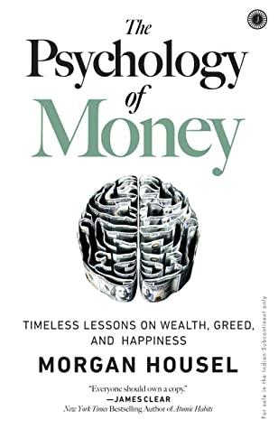

> A genius is a man who can do the average thing when everyone else around him is losing his mind - Napolean

# Table of Contents

```toc
to-heading: 2
```

---

- Doing well with money has little todo with how smart you are and a lot to do with you behave, and long term behaviour change can be difficult to achieve, even for the smartest people.
- "Ordinary" people with no financial education can be wealthy if they have a handful of behavioral skills that have nothing to do with formal measure of intelligence.

# Ronald James Read

Ronald James Read was an example of using long-term behaviour and discipline to achieve success with money.

> Ronald James Read (October 23, 1921 – June 2, 2014) was an American philanthropist, investor, **janitor, and gas station attendant.**
>
> Read amassed a **fortune of almost \$8 million** by investing in dividend-producing stocks, avoiding the stocks of companies he did not understand such as technology companies, living frugally, and being a buy and hold investor in a diversified portfolio of stocks with a heavy concentration in blue chip companies.

Source: [Wikipedia](<https://en.wikipedia.org/wiki/Ronald_Read_(philanthropist)>)

---

# Luck & Risk

> “Our findings suggest that individual investors’ willingness to bear risk depends on personal history.” Not intelligence, or education, or sophistication. Just the dumb luck of when and where you were born.

Luck and Risk are the reality that every outcome in life is guided by forces other than individual effort.

In theory, people should make investment decisions based on their goals and characteristics of investment options available to them at the time.

However, whatever our goals maybe, our risk taking capacity is tethered to our life experiences, specially in the formative years of one's life.

If you grow up at a time, when the economy is booming and healthy, and the markets are in a bull run, chances are that you would be investing more of your own money in the stock market, and be open to some riskier bets.

If one grows up in an economy going through a recession, they might prefer _Slow and Steady_ instruments like Bonds and Deposits.

## Bill Gates: A study in Hidden Luck

Bill Gates attended to one the only high schools in the world that had a computer.

Lakeside School had a computer, linked to a GE Mainframe for time-sharing, this meant that in 8th Grade, Gates had access to a computer more advanced than what most university graduates could access.

At 13, he met classmate Paul Allen who was also obsessed with the computer, the two hit it off, and the rest is history.

> In 1968 there were roughly 303 million high-school-age people in the world, according to the UN.
>
> About 18 million of them lived in the United States. About 270,000 of them lived in Washington state.
>
> A little over 100,000 of them lived in the Seattle area. And only about 300 of them attended Lakeside School.
>
> Start with 303 million, end with 300. One in a million high-school-age students attended the high school that had the combination of cash and foresight to buy a computer.

Bill Gates happened to be one of them.

Disclaimer: This is not meant to imply that Gates' success is dumb luck, it still took incredible hard work, persistence and intelligence to achieve.

> If you give luck and risk their proper respect, you realize that when judging people’s financial success—both your own and others’—it’s never as good or as bad as it seems.

### Understanding Luck

It is important to understand the concept of _Hidden Luck_, specially when you are trying to learn from lives of others.

It is difficult to identify what is luck and what is skill, and we should not attribute 100% of outcomes to effort and decisions. When learning from others, focus less on specific individuals and case studies, and more on broad patterns.

> Success is a lousy teacher, it seduces smart people into thinking they cannot lose - Bill Gates

However, the same goes in the other direction, failure can lead smart people into thinking their decisions were terrible when sometimes they just reflect the unforgiving realities of risk.

## Not worth the risk

There many things never worth risking, no matter the potential gain.

1. Reputation
2. Freedom and independence
3. Family and friends
4. Happiness

Your best shot at keeping these thing is knowing when its time to stop taking risks that might harm them. Knowing when you have is _enough_

> "Enough" is realizing that the opposite - an insatiable appetite for more - will push you to the point of regret.

---

# Compounding

> $81.5B of Warren Buffet's $84.5B net worth came after his 65th birthday

If something compounds - if a little growth serves as the fuel for future growth, a small starting base can lead to results so extraordinary they seem to defy logic.

Warren Buffet is a phenomenal investor, but you are missing out if you attach all of his success to investing acumen. The real key to his success, is time.

Buffet started investing when he was 10 years old, had he started investing in his 30s and retired at 60, few people would have ever heard of him.

His skill is investment, but his secret is time - and that is how compounding works.

- Good investment isn't necessarily about earning the highest returns, because the highest returns tend to be one-off.
- Instead, its about earning pretty good returns that you can stick with and can be repeated for the longest period of time.

---

# Getting Wealthy vs Staying Wealthy

> There are million ways to get wealthy...
>
> But there is only one way of staying wealthy: some combination of frugality and paranoia.

- Getting money requires taking risks, being optimistic and putting yourself out there.
- Keeping money requires humility, and some fear. It requires acceptance that your current success has some element of luck and therefore is not infinitely repeatable.
- The ability to stick around for a long time, without wiping out or being forced to give up, is what makes the biggest difference.

## Survival Mentality & Money

There are 2 reasons why survival mentality is key with money -

1. Few gains are so great that they're worth wiping yourself out over.
2. The counterintuitive nature of Compounding.

Compounding only works if you can give an asset years and years to grow. But getting and keeping that growth requires surviving all unpredictable ups and downs over time.

A lot of time can be spent to understand Buffet's success, but that's hard. Less hard but equally important is pointing out what he did not do -

1. He did not get carried away with debt.
2. He did not panic sell during recessions, and he lived through 14.
3. He did not gamble on his reputation.
4. He did not attach himself to one world view or trend.
5. He did not rely on others' money
6. He did not burn himself out, quit or retire

> Having and 'edge' and surviving are two different things: the first requires the second. You need to avoid ruin. At all costs. - Nassim Taleb

## Applying the Survival Mindset

### Financially Unbreakable.

**More than I want big returns, I want to be financially unbreakable**. And if I'm unbreakable, I actually think I'll be able to get biggest returns, because I'll be able to stick around long enough for compounding to work wonders.

Compounding does not rely on earning big returns, fast. _Good enough_ returns sustained uninterrupted for the longest period will always win.

### Plan for the plan not going well

- A plan is only useful if it can survive reality. And a future filled with unknowns is everyone's reality.
- A good plan embraces and emphasizes room for error.
- The more you need specific elements of a plan to be true, the more fragile your plan becomes.

You should be able to say -

> It will be great if the market returns 10% over the next 30 years, but if it only does 5%, I'll still be OK.

Margin of safety, is one of the most underappreciated forces in finance. It comes in many forms, frugal budget, flexible thinking and loose timelines.

This is different from being conservative, conservative is avoiding certain level of risk, while margin of safety is raising the odds of success at a given level of risk by increasing the chances of survival.

### Sensible Optimism

Optimism is the belief that things will go well, but that is incomplete. Sensible Optimism is a belief that the odds are in your favour and overtime things will balance out to a good outcome, even if there are some bumps along the road.

---

# Tails, you win!

Long tails, the farthest ends of a distribution of outcomes, have tremendous influence in finance, where a small number of events can account for majority of outcomes.

> Its not easy to understand that an investor can be wrong half the time and still make a fortune. It means that we underestimate how normal it is for a lot of things to fail.

## Venture Capital vs Index Funds

- Venture Capital is a tail-driven industry, if a VC makes 50 investments, they likely expect half of them to fail.
- 10 are expected to do pretty well;
- and 1 or 2 are expected to drive 100% of the fund's returns.

While most people (rightly) view venture capital as a risky business, the distribution of success among large public stocks over time is not much different than venture capital.

Most financial advice is about _today_, but today is not that important. Over the course of your lifetime as an investor, the decisions you make today or tomorrow will not matter as much as what you do during those rare days, when everyone else around you is going crazy.

> Your success as an investor is determined by how you react to punctuated moments of terror, not the years spent on cruise control.

## Tails drive everything

When you accept that tails drive everything in business, investing and finance, you realize that its normal for lots of things to go wrong, break, fail and fall.

> If you're terrific in this business, you're right six times out of ten - [Peter Lynch](https://en.wikipedia.org/wiki/Peter_Lynch)

No investor or entrepreneur makes the right decision all the time. Most successful people are packed with horrendous ideas that are often acted upon.

> Investing is not about how often you are right vs wrong, its about how much money you made when you were right, and how much did you loose when you were wrong.

You can be wrong half the time, and still make a fortune.

# Freedom

- THE HIGHEST FORM of wealth is the ability to wake up every morning and say, “I can do whatever I want today.”
- The ability to do what you want, when you want, with who you want, for as long as you want is priceless. Its the highest dividend money pays.
- Money's greatest intrinsic value, is its ability to give you control over your time.
- Using your money to buy time and options has a lifestyle benefit few luxury goods can compete with.

# Wealth is what you don't see

> Spending money to show people how much money you have is the fastest way to have less money

- We judge wealth by what we see, because that is the information in front of us, hence we rely on appearances to gauge financial success - Cars, Homes & Social Media photos.
- Modern capitalism is making it easy to fake it.
- True wealth is what what you don't see.
- Wealth is the car not purchased, the diamond not bought, the first class upgrade declined.
- Wealth are the financial assets not converted into things you can see.
- When most people think about being a millionaire, they mean they want to spend a million dollars, which is the opposite of being a millionaire.

> if you spend money on things, you will end up with things, not money.

## Rich vs Wealthy

**Rich** is the current income. Someone driving a BMW is almost certainly rich, because even if they purchased it with debt, you need a certain level of monthly income to afford that debt.

**Wealth** is hidden, its the income not spent. Its values lies in offering you options, flexibility and growth to one day purchase more stuff than you could right now.

Diet and exercise offer a useful analogy, exercise is like being rich. You think, "I did the work and now deserve a treat", wealth is turning down the treat meal and actually burning net calories.

> The problem is that it is very easy to find rich role models, its harder to find wealthy ones because by definition their success is more hidden.

This is not to say that wealthy people are not spending crazy money on stuff. The difference is that we see the home they bought, not the one they could have bought had they stretched themselves thin.

# Save Money

- Past a certain level of income people fall into three groups: Those who save, those who don’t think they can save, and those who don’t think they need to save.
- Building wealth has little to do with your investments or income and lots to do with your savings rate.
- When compared to investing, personal savings and frugality, are parts of the money equation that are more in your control and have a 100% chance of being as effective in the future as they are today.
- Learning to be happy with less money creates a gap b/w what you have and what you want - similar to the gap you get from growing your paycheck, but easier and more in you control.
- **Past a certain level of income, what you need is just what sits below your ego.**
- The most powerful way of increasing you savings is not to raise your income, but to increase your humility.
- When you define savings as the gap b/w your ego and your income, you realize why so many people with decent incomes save so little.
- **People with enduring personal finance success, tend to have a propensity to not give a damn what others think about them.**
- You don't need a specific reason to save.
- Saving is a hedge against life's inevitable ability to surprise the hell out of you at the worst possible moment.
- Intelligence is not a reliable advantage in a connected world, flexibility is.

# Surprise

> History is the study of change, ironically used as a map of the future.

- Things that have never happened before happen all the time.
- A trap many investors fall into is what I call "historians as prophets" fallacy: An over-reliance on past data as a signal to future conditions in a field where innovation and change are the lifeblood of progress.
- Investing is not a hard science, its a massive group of making imperfect decisions with limited information about things that will have a massive impact on their wellbeing, which can make even smart people nervous, greedy and paranoid.
- The most important driver of anything tied to money is the stories people tell themselves and the preferences they have for goods and services.

Two dangerous things happen when you rely too heavily on investment history as a guide to what's going to happen next.

1. You'll likely miss the outlier events that move the needle the most
   1. A very, very small number of people were responsible for majority of the world's direction in the last century.
   2. The majority of what's happening at any given moment in the global economy can be tied back to a handful of past events that were nearly impossible to predict.
   3. The most important economic events of the future—things that will move the needle the most—are things that history gives us little to no guide about. They will be unprecedented events.
2. History can be a misleading guide to the future of the economy and stock market because it doesn't account for structural changes that are relevant to today’s world.
   1. Venture capital as an industry is barely 30 years old, before that people heavily relied on generosity of bankers. This means, that all historical data, before that is already out of date.
   2. The S&P 500 did not include financial stocks until 1976; today, financial make up 16% of the index. Technology stocks were virtually nonexistent 50 years ago. Today, they’re more than a fifth of the index. Accounting rules have changed over time.

The further back in history you look, the more general your takeaways should be. General things like people’s relationship to greed and fear, how they behave under stress, and how they respond to incentives tend to be stable in time. The history of money is useful for that kind of stuff.

But specific trends, specific trades, specific sectors, specific causal relationships about markets, and what people should do with their money are always an example of evolution in progress. Historians are not prophets.

# Room for error

> The most important part of every plan is planning on your plan not going according to plan.

- There is never a moment when you're so right that you can bet every chip in front of you.
- History is littered with good ideas taken too far, which are indistinguishable from bad ideas.
- Margin of Safety, or room for error is the only way to safely navigate a world governed by odds not certainties.
- People underestimate the room for error; the person who speaks in absolutes will have more followers than the one who speaks in probabilities.
- The person with enough room for error in part of their strategy (cash) to let them endure hardship in another (stocks) has an edge over the person who gets wiped out, game over, insert more tokens, when they're wrong.
- You can plan for every risk except the things that are too crazy to cross your mind. And those crazy things can do the most harm, because they happen more often than you think and you have no plan for how to deal with them.
- A good rule of thumb for a lot of things in life is that everything that can break will eventually break.

> The biggest single point of failure with money is a sole reliance on a paycheck to fund short-term spending needs, with no savings to create a gap between what you think your expenses are and what they might be in the future.

---

# You'll Change

> Long-term planning is harder than it seems because people's goals and desires evolve over time.

- Imagining a goal is easy and fun. Imagining a goal in the context of realistic life stresses that grow with competitive pursuits is something entirely different.
- The first rule of compounding is to never interrupt it unnecessarily.
- We should avoid extreme ends of financial planning. Assuming you will be happy with a low income, or choosing to work endless hours in pursuit of a higher income increases the odds that you will, one day find yourself at a point of regret.
- Aiming, at every point in your working life, to have moderate annual savings, moderate free time, no more than a moderate commute, and at least moderate time with your family, increases the odds of being able to stick with a plan and avoid regret than if any one of those things fall to the extreme sides of the spectrum.
- Sunk costs are a devil in a world where people change over time. They make our future selves, prisoners to our past, different selves.
- Embrace the idea that financial goals made when you were a different person should be abandoned without mercy can be a good strategy to minimize future regret.

---

# Nothing's Free

- Most things are harder in practice than they are in theory. Sometimes, this is because we are overconfident. Mostly, its because we are not good at identifying the cost of success, which prevents us from being able to pay it.
- Successful investing demands a price. Its currency however is volatility, fear, doubt, uncertainty and regret.
- The volatility/uncertainty fee—the price of returns—is the cost of admission to get returns greater than low-fee parks like cash and bonds.

---

# You & Me

- Blaming bubbles on greed and stopping there misses important lessons about how and why people rationalize what in hindsight look like greedy decisions.
- **Investors often take cues from other investors who are playing a different game than they are.**
- When investors have different goals and time horizons, and they do in every asset class, prices that look ridiculous to one person can make sense to another.
- A day trader can pick up an extremely risky stock, because they will hold it for a few hours, that does not make it a good fit for someone looking at a 2,5 or 10 year horizon.
- It's hard to grasp that other investors have different goals than we do, because an anchor of psychology is not realizing that rational people can see the world through a different lens than your own.

## On Bubbles

- Bubbles form when the momentum of short-term returns attracts enough money that the makeup of investors shifts from mostly long term to mostly short term.
- The mere idea of a bubble is controversial, because no one wants to think they own an overvalued asset.
- Bubbles aren't so much about valuations rising, its a symptom of time horizons shrinking as more short term traders enter the playing field.
- The formation of bubbles isn't so much about people irrationally participating in long-term investing. They're about people somewhat rationally moving toward short-term trading to capture momentum that had been feeding on itself.

# The Seduction of Pessimism

> For reasons I have never understood, people like to hear that the world is going to hell - Historian Deirdre McCloskey

- Pessimism sounds smarter than optimism.
- Real optimists don't believe that everything will be great. That's complacency.
- Optimism is a belief that the odds of a good outcome are in your favour over time, even when there will be setbacks along the way.
- Pessimism just sounds smarter and more plausible than optimism.
- Few question or try to explain why the market went up—isn’t it supposed to go up?—there is almost always an attempt to explain why it went down.
- There are two topics that will affect your life whether you are interested in them or not: money and health. While health issues tend to be individual, money issues are more systemic.
- There is an iron law in economics: extremely good and extremely bad circumstances rarely stay that way for long because supply and demand adapt in hard-to-predict ways.
- There are lots of overnight tragedies. There are rarely overnight miracles.
- Growth is driven by compounding, which always takes time. Destruction is driven by single points of failure, which can happen in seconds, and loss of confidence, which can happen in an instant.
- In investing you must identify the price of success— volatility and loss amid the long backdrop of growth—and be willing to pay it.

# When You'll Believe Anything

> Appealing fictions, and why stories are more powerful than statistics

- In 2007, we told a story about the stability of housing prices, the prudence of bankers, and the ability of financial markets to accurately price risk. In 2009 we stopped believing that story.
- Once the narrative that home prices will keep rising broke, mortgage defaults rose, then banks lost money, then they reduced lending to other businesses, which led to layoffs, which led to less spending, which led to more layoffs, and on and on.

At the personal level, there are two things to keep in mind about a story-driven world when managing your money.

## Appealing Fiction

> The more you want something to be true, the more likely you are to believe a story that overestimates the odds of it being true.

There are many things in life that we think are true, because we desperately want them to be true, these are "Appealing Fictions".

An appealing fiction happens when you are smart, you want to find solutions, but face a combination of limited control and high stakes.

## Incomplete World views and our narratives

> Everyone has an incomplete view of the world. But we form a complete narrative to fill in the gaps.

- Part of the reason forecasting the stock market and the economy is so hard is because you are the only person in the world who thinks the world operates the way you do. When you make decisions for reasons that I can’t even comprehend, I might follow you blindly into a decision that’s right for you and disastrous to me.
- Coming to terms with how much you don’t know means coming to terms with how much of what happens in the world is out of your control. And that can be hard to accept.
- Psychologist Philip Tetlock once wrote: “We need to believe we live in a predictable, controllable world, so we turn to authoritative-sounding people who promise to satisfy that need.”
- Business, economics and investing are fields of uncertainty, overwhelmingly driven by decisions that can't easily be explained with clean formulas, but we desperately want it to, because the idea of being in control is beautiful and comforting.
- We focus on what we know and neglect what we do not know, which makes us overly confident in our beliefs.

---

# All together now

- Wealth is created by suppressing what you could buy today in order to have stuff or options in the future.
- The question - "does this help me sleep at night?" is the best guidepost for all financial decisions.
- Time is the most powerful force in investing, it makes little things grow big and big mistakes fade away.
- Judging how you've done by focusing on individual investments makes winners look more brilliant than they were and losers appear more regrettable than they should.
- Use money to gain control over your time, because not having control of your time is such a powerful and universal drag on happiness.
- No one is impressed with your possessions as much as you are.
- If you want respect and admiration, you are likely to gain those things through kindness and humility than horsepower and chrome.
- Savings that are not earmarked for anything are hedge against life's surprises.
- You should like risk, because if pays-off over time, but you should be paranoid of ruinous risk because it prevents you from taking future risks that will pay off overtime.

---

# Confessions

- Like many things, even in finance, their is no universal truth. Its only about what works for you & your family in a way that leaves you comfortable and sleeping well at night.
- Our goal isn't to be coldly rational; just psychologically reasonable.
- Consumption became an explicit economic strategy in the years after World War II. An era of encouraging thrift and saving to fund the war quickly turned into an era of actively promoting spending
