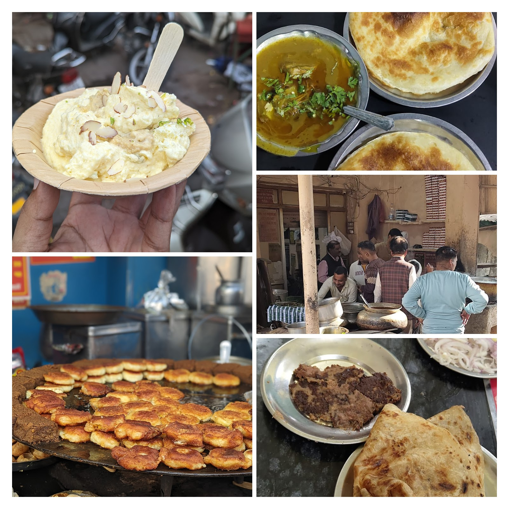
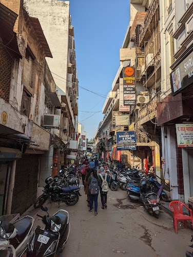
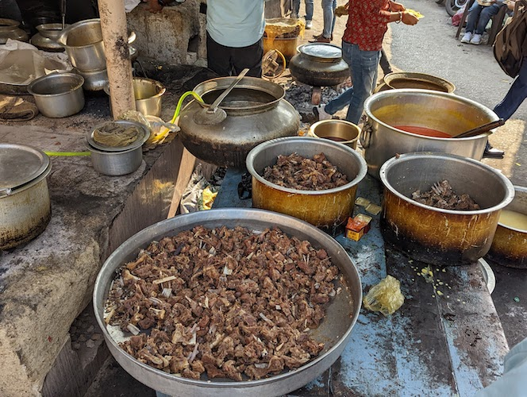
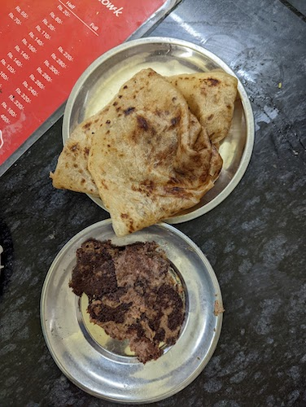
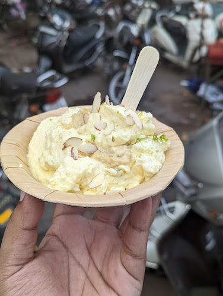
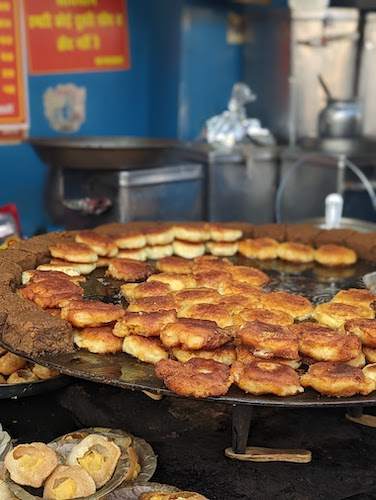
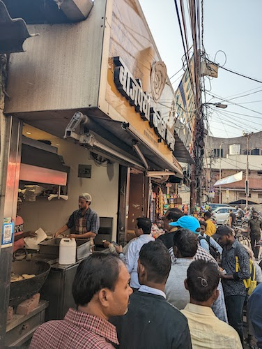
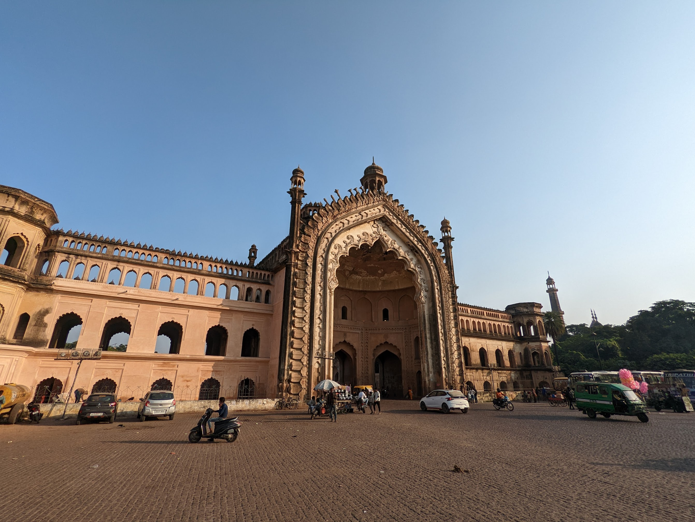

Earlier this week, I, along with a couple of friends visited [Lucknow](https://www.tripadvisor.in/Tourism-g297684-Lucknow_Lucknow_District_Uttar_Pradesh-Vacations.html). While Lucknow has several tourist destinations, its a great place for foodies, specially if you are a non-vegetarian.

<em class="img-caption">(Almost) All foods (Clockwise) - Makhan Malai/Daulat Ki Chaat, Nihari Kulcha, Idris Biryani, Tunday Kebab & Shukla Chat</em>

## The Itinerary

Between the 3 of us, we wanted to eat the famous Tunday Kebab, Avadhi Biryani, Makhan Malai and Chaat(for the vegetarian among us). Luckily, all these are available in the Chowk, and so we settled on the following itinerary -

1. Biryani at Idris Biryani.
2. Tunday Kebab at Tunday Kebabi.
3. Nihari at Raheems
4. Malai Makhan
5. Chaat at Shukla Chaat, Hazratganj, this was a recommendation from our cab driver.
6. Bajpayee Kachodi Bhandar, Hazratganj.

<em class="img-caption">The Streets of the Chowk</em>

## Idris Biryani

<em class="img-caption">Outside Idris, not pictured here - the actual biryani</em>

My friend is a huge, huge Biryani fan, the kind that can start their day with the rice based delicacy, so naturally he wanted to have some Avadhi Biryani.

Idris was the most interesting experience for me. As soon as you reach, you are greeted with massive vessels slow cooking rice and meat, the smell of the biryani overpowering that of the crowd waiting to get it.

Idris has a small area for sitting, as luck would have it, it was so full, that they ran out of seats & the cutlery. Our biryani was given to us in a box usually seen in traditional sweet shops.

The biryani itself was amazing, the spices were mild, but rich in flavour and the mutton was cooked perfectly. We would have liked one more piece, but at Rs. 150 for a half plate, that's probably just me being greedy!

## Tunday Kebab

<em class="img-caption">Tunday Kebab and Mughlai Paratha</em>

[Tunday Kebab](https://en.wikipedia.org/wiki/Tunde_ke_kabab) is probably the most famous dish in Lucknow. You get it in both mutton and buffalo meat variants.

Not much to say here, this dish was every bit worth the hype. The kebab's were soft, melting in your mouth and full of taste. The Mughlai Paratha was buttery, fresh and a perfect foil to the kebabs.

## Raheem's Nihari

<em class="img-caption">Nihari and Kulcha</em>

Right opposite Tunday, is a small, but busy outlet called Raheem's. Raheem's Nihari was another local recommendation I am glad I followed.

The slow-cooked stew of buffalo meat, accompanied by fresh kulcha, was tasty, tender and covered in a layer of Ghee.

The Kulcha itself was tasty and fresh and complemented the Nihari perfectly.

## Makhan Malai

Growing up in the neighbouring city of Kanpur, winters were about foggy mornings, the struggle to get out of your comforter and Makhan Malai.
10 years ago, I moved to Delhi-NCR and then to Bangalore, and Makhan Malai is a dish that you don't find easily anywhere (except Old Delhi on Winter mornings), naturally, I was so looking forward to reliving those memories.

Makhan Malai takes roughly 8 hours to prepare and is made with milk, cream, sugar, cardamom and dry fruits. Its fluffy, light and subtle in flavor.

<em class="img-caption">Makhan Malai</em>

My search for makhan came to an end on the other end of chowk, 10 minutes of walk from Raheem's and Tunday and it was everything I expected it to be. It was fluffy, not very sweet, and delectable.

## Shukla Chaat

<em class="img-caption">Aloo Tikki and Pani Puri</em>

After waiting patiently all day, it was time for the only vegetarian in the group to have some fun (& food)!

On the recommendation of our cab driver, we made our way to Shukla Chaat in Hazratganj.

We started with Pani Poori (or Golgappe!) and they tasted amazing. The water was just the right amount of spice and the shop keeper offered us extra water for the complete experience.

Following the Pani Poori, was the Aloo Tikki, I don't know how to describe these flavours, so I'll just say it was full of flavours, fresh and damn tasty!

## Bajpayee Kachodi Bhandar

<em class="img-caption">The queue outside Bajpayee</em>

A short walk from Shukla's is the Bajpayee Kachodi Bhandar. When we arrived, we had to get in a long-(ish) queue. It was late afternoon, and the Kachodi place had run out of the Kachodi's. So we opted for a plate of Chole Poori.

The Poori was crispy, deep-fried and the Chole were homely. It was a very familiar and flavour-ful combination.

---

By the time we reached our hotel, all of us were happy, full and satisfied. Lucknow had fulfilled all the promises it made and left us with memories that we will cherish for times to come!

